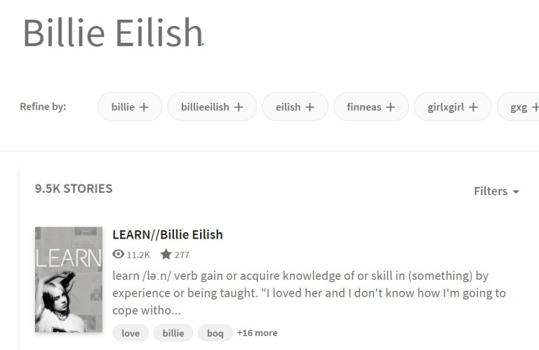
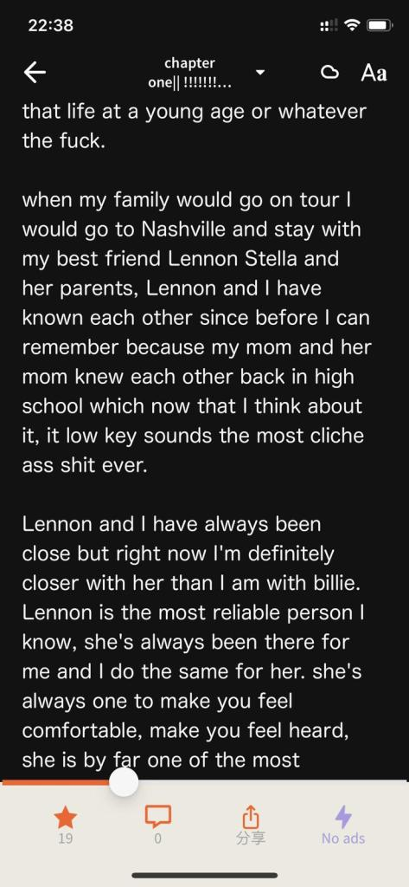

## 引言

_本文章內容由舊版個人網站搬遷而至_  
舊版網頁本來於 Wordpress 建立，因深感其工能開發上的難度，因而一直未有更新內容。

---

> 我們在天上的父啊，願人都尊祢的名為聖，願祢的國降臨，願祢的旨意，
> 行在地上，如同行在天上。我們日用的飲食，今日賜給我們；免我們的債，
> 如同我們免了人的債。不叫我們遇見試探，救我們脫離兇惡；
> 因為國度，權柄，榮耀，全是祢的，直到永遠。阿們！
>
> -   《路加福音》第 11 章第 2-4 節

---

於二零二零年八月二十四日，經過左兩個多星期的研究和苦難，
我 Danny 仔 終於都成功建立了一個由伺服器到域名到網頁前後台都屬於我自己的網站。

其實這並不是第一次我用 Wordpress 來建立網站了，
認識我的人可能知道我之前在跟一位大佬做生意的時候，
就曾經由零開始接觸網頁製作。
那時都已經知道其實一個網頁由零到真正可以運行都非三言兩語能夠說明及解決。

不論如何，我都已經在這兩個星期的工作時間內卯足了吃奶的力氣，
和一點點猶大的智慧，終於完成了一個一直以來都想做的事。

這個網頁的用途暫定作日常抱怨、
技術或好西分享及個人簡介之用。
實不相暪，這個網頁我是為了找工作才開始建立的。
之後想到其他用途的時候再作打算吧。

既然作為於 Wordpress 上創作的第一篇文章，
就這樣草草結尾終也有點遺憾，
那就順便推薦一款最近一直在使用的英文閱讀型 Application 吧！

---

## -淺談 **Wattpad** 之路-

---

### 超連結

> 先附上 Wattpad 的超連結吧  
> 網頁版： https://www.wattpad.com/home  
> 手機版(Ios)： https://apps.apple.com/us/app/wattpad-read-write-stories/id306310789  
> 手機版(Android): https://play.google.com/store/apps/details?id=wp.wattpad

### 介紹

以下內容基本上純屬本人無聊腦補加上 Wikipedia 的內容補充而成。

Wattpad 是一個 2006 年建立的在線作者、讀者社區，提供了一個讀者和作者直接交流的平台，
簡單點說也就是個讀書 APP。其中的內容我敢說大部份都是英文為主，偶爾也會有些其他語種。
這個讀書 APP 獨特的地方在於其歐美同人小說內容充足，深度廣度皆宜。

---

**_是的是以英文為主的讀書 APP。_**

---

我大約在六月的時候第一次接觸這個網頁，當時我在 YouTube 上迷上了美國一位風格特立獨行的歌手  
`Billie Eilish - (陸台譯「怪奇比莉」，我心諗做乜勁?)`  
在 YouTube 上近乎沉迷式的找了所有關於她的影片。一看；一天就過了。比精神時光屋還要強上十萬八千倍。

雖說 YouTube 上聲畫俱全，影片林林總總，看也看不完。但我身為一名「讀書人」(自稱)，
當然還是文字這個媒介對我最為吸引。於是我便萌生了閱讀有關 Billie Eilish 同人小說的念頭。

當時的想法是，B.E 在全球這麼火紅，最近(2020 年初)更是勇奪 Grammy 六項的獎盃，
其中四項更是每年也「爭崩頭」的主要獎別，再怎麼不濟也應該有數本相關的中文同人書籍值得一覽吧？

然而，我使用中港台三地不同譯名在 Google 上搜尋了足足三頁!!!😱 也沒有找到任何結果，
反而是有不少英文的內容跑了出來。實在令人大跌眼鏡。

沒辦法，只能告訴自己，想看書，就要克服對閱讀英文的心理障礙。相信不少人也是因為這個原因而錯過了不少其他語言的文章書籍，
其實甚是可惜。我其實也是內心爭扎了數天才下定決心，決定上網找尋有關的英語讀物。

在 Google 上搜尋 Fan fiction app 後，我嘗試了數款的閱讀網站/軟件，當中書籍最多，
用戶最活躍，更新最頻繁的當屬 Wattpad。其 UI design 雖然不及大陸的小說軟件，但至少也已經是較為現代的設計，。
(相比起來有幾個外國的閱讀網站頁面真的是像極了回到三國。)

> 
>
> 這裡就試試看隨便找一些 Billie Eilish 的相關內容看看吧！

只不過是隨便找找都有 9500 本以上的書籍內容，已經比華人圈內近乎 0 的數目高無數倍了。
那我當然是馬上下載了 Wattpad 的手機 APP 來用囉。畢竟日常使用最方便的閱讀工具就是手機了。

> 
>
> 這裡就試試看隨便找一些 Billie Eilish 的相關內容看看吧！

這裡以其中一本我在追蹤的書作例。現實中的閱讀 UI 大概長這樣，軟件相比其他歐美同類型軟件已經設計得不錯了，
該有的功能也不少，比如字體大小、分頁閱讀、背景顏色及分段留言這種新興功能等等。雖然不到完美，但至少很有閱讀體驗。

但有一點我覺得真的過於擾民的設計不得不拿出來說一說，在你閱讀到達了一定時間及一定章節後，
軟件會強制彈出為時 5 – 15 秒不等的廣告。跳過廣告的唯一辦法便只有「課金」，理解。那麼需要收費多少呢？  
嗯。。。一個月最低消費 38 HKD，真係「多謝夾盛惠」🤑。

###### 你是看不起我這種窮苦書生一個月連 38 元也付不起嗎?🤬🤬🤬

我就在廣告和 Wattpad 中來回地獄又折返人間。雖然在觀賞圖書的過程中彈出廣告是很令人掃興，又令整個閱讀更不流暢，但為了那眾多的歐美書庫，
我忍了。Wattpad 製作人為了維持營運成本不得不出此下策也是無可厚非吧。畢竟不是所有人都似國內的平台一樣財雄勢大，
或許我只是被其他閱讀軟件的閱讀習慣養刁了胃口吧。窮人就只能安慰自己廣告是閱讀途中休息的好機會。

在不斷閱讀的過程中，你很快會感覺自己英文詞彙量大增，每每閱讀一本書籍下來也至少能學到約 20 – 40 個不等的英文生字。
長久下去對英文能力幫助一定比你硬背字典要來得更好也更實用。

---

## 結尾

---

- 閱讀體驗：★★★  —　３分（廣告扣了兩分）
- 書籍數量：★★★★★  —　５分（冠絕歐美閱讀App）
- 題材種類：★★★★　 —　４分（這個其實不好說，但我覺得好像都看不完）
- 作家功能：★★★★　 —　４分（小弟不材，在Wattpad上也寫了一本練手作，隨心情更新，有緣人自然會看到吧）
